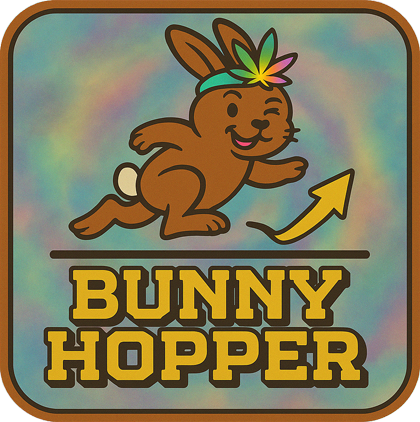

[](https://www.scheduleonegame.com/)
[](https://melonwiki.xyz/#/)
[](https://github.com/RoachxD/ScheduleOne.BunnyHopper/releases/tag/v1.1.0)
[](LICENSE.md)

Tired of your thumbs getting a workout just to maintain momentum in Schedule I? Well, fret no more!

Introducing **Bunny Hopper**, the mod born out of a deep and *slightly* amused observation of the limitations of previous auto-jump attempts.

Inspired (and perhaps a little exasperated) by the noble but ultimately flawed efforts of others (I'm talking about you, Robert), **Bunny Hopper** aims to provide a seamless and enjoyable bunny hopping experience in Schedule I. No more accidental stops, no more missed jumps, *and crucially*, NO MORE ACCIDENTAL JUMPS! Just smooth, continuous movement that'll make you the envy of every farmer and factory worker.

## Features

* **Effortless True Auto-Jumping:** Once enabled, **Bunny Hopper** will automatically trigger a jump the moment you land, allowing you to maintain speed and traverse the world with newfound agility.
* **Reliable Ground Detection:** The mod uses a robust method to detect when the player lands, ensuring that jumps are only triggered when truly appropriate.
* **Smooth Experience:** Designed to work seamlessly with the game's physics, **Bunny Hopper** provides a fluid and responsive jumping experience without any hiccups or interruptions.
* **Bi-Flavored:** Available in both Il2Cpp and Mono versions, so you can choose the one that suits your game setup.
* **Configurable Settings:** Easily toggle the mod on or off and adjust the auto-jump liftoff timeout through MelonLoader's preferences system, allowing you to customize your experience to your liking.

## How It Works

This mod patches into the player's movement logic. When enabled and the jump key is held:

1. It detects when the player lands.
2. It automatically triggers another jump.
3. A small timeout (`AutoJumpLiftoffTimeoutMilliseconds`) ensures the game registers the liftoff before attempting another jump, making it feel smooth and reliable.

## Installation

1. Ensure you have [MelonLoader](https://melonwiki.xyz/#/) installed for Schedule I.
2. Download the appropriate mod flavor from the latest [Releases page](https://github.com/RoachxD/ScheduleOne.BunnyHopper/releases/latest).
    * If your game is the IL2CPP (default) version, download `BunnyHopper.Il2Cpp.dll`.
    * If your game is the Mono (alternate) version, download `BunnyHopper.Mono.dll`.
3. Place the downloaded `*.dll` file into the `Mods` folder within your Schedule I game directory.
4. Launch the game!

## Configuration

You can configure **Bunny Hopper** through MelonLoader's preferences system. The settings are located in `UserData/MelonPreferences.cfg` (under the `[BunnyHopper_Settings]` category) or can be adjusted using a UI mod that supports MelonPreferences.

* **`Enabled`** (Default: `true`)
  * Set to `true` to enable bunny hopping, `false` to disable.
* **`AutoJumpLiftoffTimeout`** (Default: `75`, Min: `55`, Max: `110`)
  * The duration in milliseconds the mod awaits an auto-jump liftoff confirmation before considering the action potentially failed or suppressed. This is already set to a reasonable value, as the game takes about 50ms to register a jump. Only adjust this if you experience issues with the timing of your jumps, which is *extremely* unlikely.

## What's Next?

* [ ] Investigate and implement skateboard hopping mechanics for enhanced movement speed.
* [ ] (VERY BIG MAYBE!) Explore advanced obstacle interaction: Calculate optimal jump timing (based on player speed and direction) to perfectly land on tracked obstacles and chain jumps more fluidly.

## Contributing

If you have suggestions, bug reports, or witty remarks about previous auto-jump attempts, feel free to open an issue on the project's repository!

### Building from Source

If you'd like to build the mod yourself or contribute to its development, here's what you need to know:

1. **Prerequisites:**
    * [.NET SDK](https://dotnet.microsoft.com/download): Ensure you have the .NET SDK installed. The project uses .NET 6.0 for Il2Cpp builds and .NET Framework 4.7.2 for Mono builds.
2. **Game Directory Setup:**
    * This project requires an environment variable named `ScheduleOneGameDir` to be set. This variable must point to the root directory of your Schedule I game installation (e.g., `C:\Program Files (x86)\Steam\steamapps\common\Schedule I`).
    * The build process uses this path to locate necessary game assemblies and to copy the built mod DLLs directly into your game's `Mods` folder.
3. **Build Configurations:**
    * The project supports multiple build configurations:
        * `Debug_Il2Cpp` / `Release_Il2Cpp`: For the standard Il2Cpp version of the game. Debug includes debugging symbols.
        * `Debug_Mono` / `Release_Mono`: For the alternate Mono version of the game. Debug includes debugging symbols.
    * You can select the desired configuration when building via the command line or your IDE.
4. **Building the Mod:**
    * **Using an IDE (e.g., Visual Studio, JetBrains Rider):** Open the `BunnyHopper.sln` solution file and build the project, selecting your desired configuration.
    * **Using the .NET CLI:** Navigate to the project's root directory in your terminal and use the `dotnet build` command. For example, to build the Il2Cpp Release version:

        ```shell
        dotnet build -c Release_Il2Cpp
        ```

    * **VS Code Users:** The repository includes a `.vscode/tasks.json` file which defines build tasks for all configurations. You can run these tasks directly from VS Code (e.g., by pressing `Ctrl+Shift+B` and selecting a build task).
5. **Output:**
    * The compiled mod (`.dll` file) will be placed in the appropriate `bin\[Configuration]\[TargetFramework]` subfolder within the project directory (e.g., `bin\Release_Il2Cpp\net6.0`).
    * The build process will also automatically copy the compiled mod to the `Mods` folder in your Schedule I game directory.

## Credits

* **[Roach_ (Adrian Nicolae)](https://github.com/RoachxD):** Developer and maintainer of **Bunny Hopper**.
* **[miapuffia (Robert D. Rioja)](https://github.com/miapuffia):** For being the inspiration behind this mod, proving that sometimes, you just have to do it yourself. All kidding aside, your work on auto-jumping was a great starting point and a learning experience, and I am thankful for your work and contributions to the modding community.
* **[MelonLoader Team](https://melonwiki.xyz/#/):** For providing the framework that makes modding Schedule I possible.
* **[Tyler's Video Game Studio](https://www.scheduleonegame.com/presskit/schedule-one/index.html#about):** For creating such an engaging game (that sparked the need for this mod).

## License

This project is licensed under the MIT License - see the [LICENSE.md](LICENSE.md) file for details.

---

Happy Hopping! 🐰
